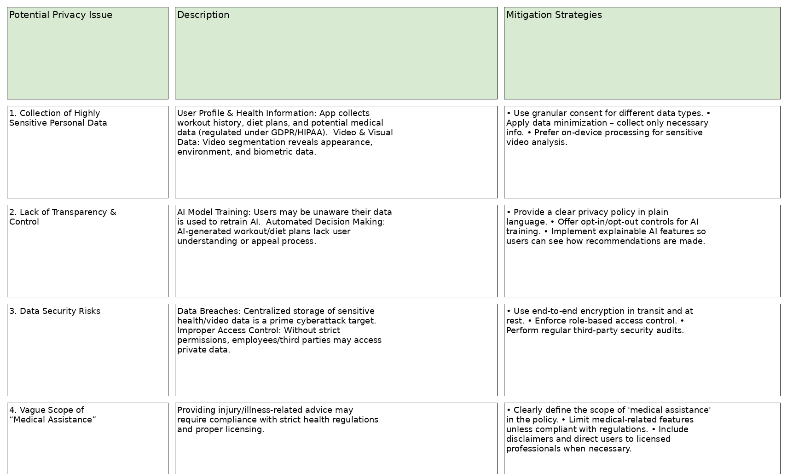

# Design - Data & AI for Gym Buddy

## Data Collection

TODO(Akhila1906): Fill this section based on your analysis.

To make GymBuddy smart and reliable, it needs a lot of high-quality workout data. Collecting this data isn’t just about
recording videos — it’s about doing it in a way that captures the right moments, protects privacy, and reflects the variety
of ways people exercise.

**Capturing the Right Moments**
Our goal is to teach GymBuddy to focus on actual workouts, not background noise. That means carefully segmenting videos so
the AI learns from movements that matter — whether it’s a squat, push-up, or bicep curl — and ignores people walking by or
chatting in the background.

**Keeping Privacy a Priority**
We know that workout videos are personal. That’s why we’re committed to protecting users’ privacy by blurring backgrounds,
hiding faces, and removing any details that could identify someone. This way, we can still learn from the movements without
exposing personal information.

**Labeling Every Detail**
For GymBuddy to understand what’s happening in a video, each clip needs to be labeled with the exercise type, rep count, and
rest periods. This is no small task — manually tagging thousands of clips takes time — so we’re combining human labeling with
smart tools to speed things up without losing accuracy.

**Covering Every Workout Style**
Everyone’s workout looks a little different — different body types, clothing, camera angles, lighting, and even form. By
collecting a wide variety of examples, we make sure GymBuddy can recognize and adapt to all kinds of users and environments.

**Learning Over Time**
Fitness trends change, and so will GymBuddy. We’ll keep collecting new workout videos (with user permission) so the AI can
keep up with fresh exercises, new equipment, and updated training styles.

**Checking and Improving**
If GymBuddy makes a mistake — like miscounting reps — we want to know. By building in ways for users to give feedback and by
keeping “ground truth” reference data, we can retrain the AI to get smarter and more accurate with each update.

## Sample dataset

TODO(akshay-834): Fill this section based on your analysis.
[SampleDataSet.xlsx](https://github.com/user-attachments/files/21748541/SampleDataSet.xlsx)
Sample dataset contains the details of excercise along with the data

## Generic chatbots

TODO(): Fill this section based on your analysis.
https://gym-bot-rose.vercel.app/

An AI-powered fitness assistant that supports text, video, and voice interactions to help users with their workout routines, nutrition advice, and progress tracking in real time. It can answer fitness-related queries, suggest personalized workout plans, and provide motivation to keep users on track with their goals.

**Features Included:**

**Text Chat:** Instant Q&A for workout tips, nutrition guidance, and fitness advice.

**Voice Input/Output:** Hands-free interaction through speech-to-text and text-to-speech—ideal during workouts.

**Video Integration:** Demonstrates exercises through short instructional clips for correct form and technique.

**Multimedia Responses:** Combines text, audio, and video to provide clear, engaging fitness guidance.

**Cross-Platform Compatibility:** Works seamlessly on both web and mobile devices, making it accessible anytime, anywhere.
## Pre-built APIs
TODO(MalapatiPavan): Fill this section based on your analysis.

**High Priority:**

  **Google MediaPipe** – Your primary engine for real-time pose estimation, gesture detection, and rep counting. This is what enables the core “passive tracking”     experience in GymBuddy.

  **Firebase API Key** – Handles real-time database storage, user authentication, and syncing workout data between the mobile app and dashboard.

  **AWS Rekognition** – Useful for detecting people and activities from stored video when you want server-side verification or to handle cases where on-device         tracking isn’t possible.

**Medium Priority** 

  **OpenPose** – More accurate for multi-person pose estimation than MediaPipe, but heavier to run. Could be added later for gyms with multiple people in the         camera view.

  **Gemini API** – Adds AI-driven workout recommendations and can detect gym equipment in the scene for richer logging.

  **Wearable Device API Key** – Allows syncing with smartwatches or fitness trackers to incorporate heart rate, calories, and movement data alongside video           tracking.

**Low Priority**

  **DeepLabCut** – Lets you do custom pose tracking for rare or unusual exercises, but requires extra labeled data and model training.

  **Azure Video Indexer** – Provides activity, face, and timestamp extraction from videos, which is more for analytics than real-time tracking.

  **YouTube Data API** – Lets you integrate workout video search and recommendations inside the app, which is unrelated to passive tracking but good for community     or learning features.

## Vision Algorithms

TODO(): Fill this section based on your analysis.

| **API**                     | **Algorithm Used**                          | **Explanation**                                                                                                                                                                                               |
| --------------------------- | ------------------------------------------- | ------------------------------------------------------------------------------------------------------------------------------------------------------------------------------------------------------------- |
| **Google MediaPipe**        | **CNN + landmark regression**               | Uses Convolutional Neural Networks (CNNs) to detect features in images or videos, then applies landmark regression to precisely locate key points (e.g., face landmarks, hand joints) for real-time tracking. |
| **OpenPose**                | **CNN-based keypoint estimation**           | A deep learning model that uses CNNs to estimate positions of human body joints (keypoints) from images, enabling pose estimation for multiple people.                                                        |
| **DeepLabCut**              | **ResNet-based CNN**                        | Built on a Residual Network (ResNet) architecture for high-accuracy animal or human pose estimation, even with limited training data.                                                                         |
| **AWS Rekognition**         | **CNNs + object detection pipelines**       | Uses CNN-based deep learning models combined with multi-stage object detection frameworks (like R-CNN or SSD variants) to identify objects, faces, and scenes in images and videos.                           |
| **Azure Video Indexer**     | **Ensemble of DNNs for action recognition** | Employs multiple deep neural networks (DNNs) working together to recognize actions, gestures, and events in videos.                                                                                           |
| **Firebase API Key**        | **Firebase token-based, JWT**               | Uses token-based authentication with JSON Web Tokens (JWT) to securely identify users and control API access.                                                                                                 |
| **Gemini API**              | **OAuth 2.0, Gemini/Google Cloud AI**       | Implements OAuth 2.0 for secure authorization and uses Google’s AI models for data processing and analysis.                                                                                                   |
| **YouTube Data API**        | **Google API credential**                   | Requires authentication via Google’s credential system, often with OAuth 2.0, to access YouTube data securely.                                                                                                |
| **Wearable Device API Key** | **OAuth 2.0, device OAuth**                 | Uses OAuth 2.0 with device-specific authorization flows to connect wearables securely to applications.                                                                                                        |

## Privacy

TODO(Shriyasoni21) : Fill this section based on your analysis.

